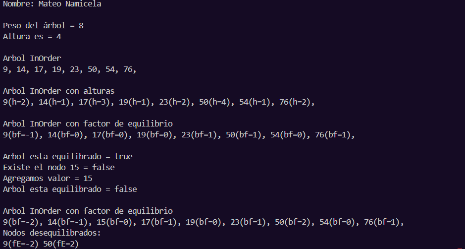
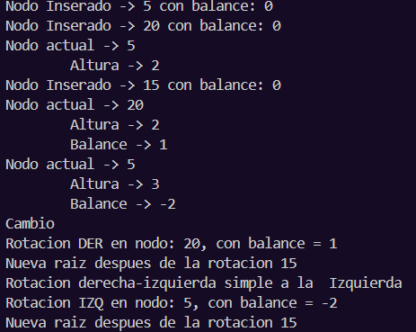

# Práctica de Algoritmos de Ordenamiento

## 📌 Información General

- *Título:* Práctica de Estructuras Lineales
- *Asignatura:* Estructura de Datos
- *Carrera:* Computación
- *Estudiante:* Mateo Namicela
- *Fecha:* 19/6/2025
- *Profesor:* Ing. Pablo Torres

